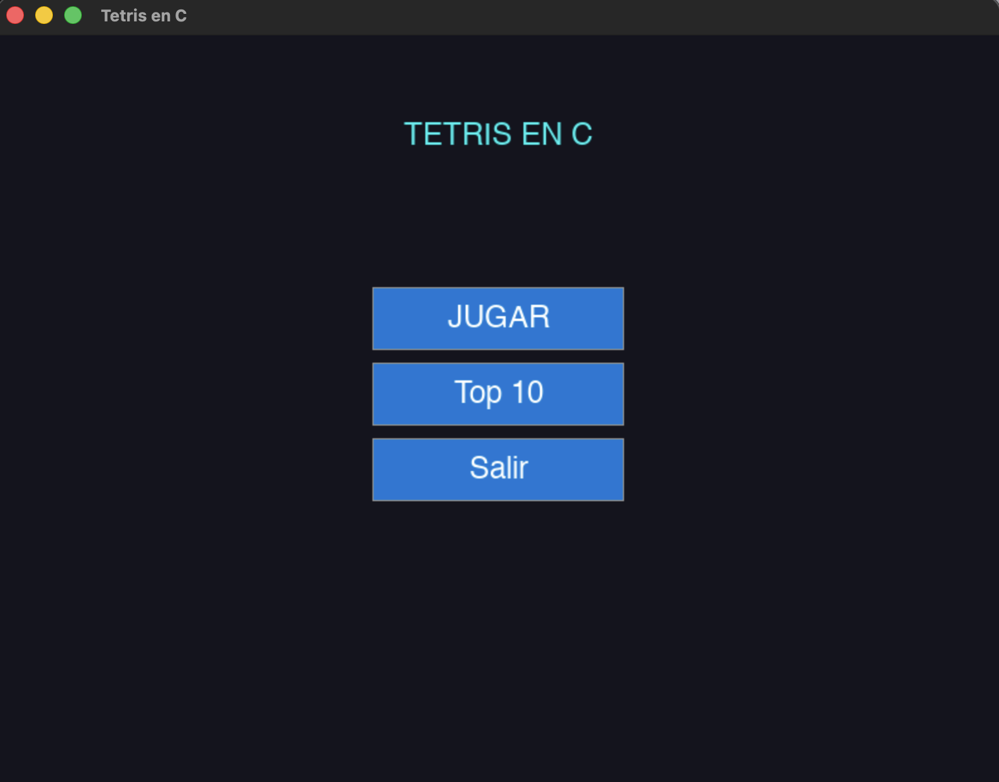
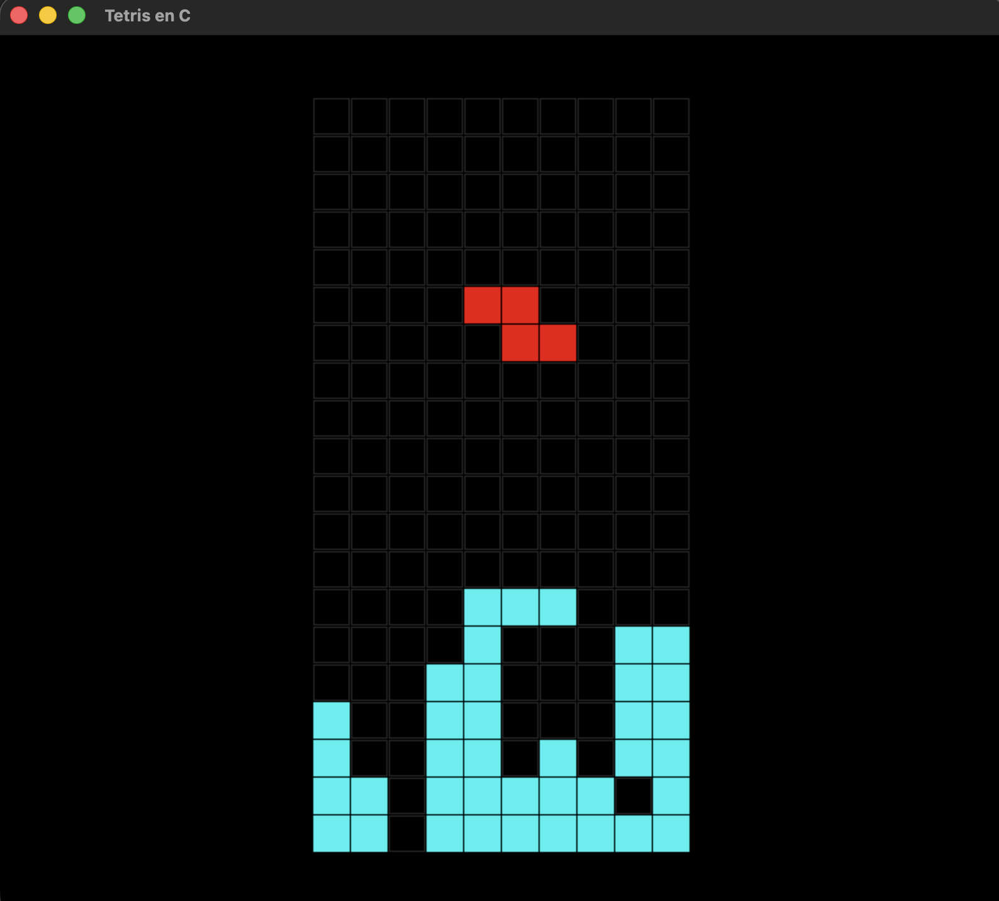

# Tetris en C

Tetris implementado en C, utilizando la librería SDL2 para los gráficos y SQLite para la persistencia de datos.

## Vistazo del Juego




## Características

- Juego completo de Tetris con las 7 piezas clásicas.
- Sistema de rotación de piezas y Wall Kicks (basado en SRS).
- Sistema de colisiones, eliminación de líneas y puntuación.
- Tabla de high scores para ver los 10 mejores puntajes.
- Base de datos SQLite para guardar puntajes de forma persistente.

## Requisitos e Instalación

Primero, asegúrate de tener las herramientas de compilación básicas (`gcc`, `make`) y luego instala las dependencias según tu sistema operativo.

#### Para Linux (distribuciones basadas en Debian/Ubuntu):
```bash
sudo apt-get update
sudo apt-get install -y build-essential libsdl2-dev libsqlite3-dev
```

#### Para macOS (usando Homebrew):
```bash
brew install sdl2 sqlite3
```

#### Para Windows (usando MSYS2/MinGW):
Se recomienda instalar [MSYS2](https://www.msys2.org/) y luego, desde su terminal, instalar las dependencias necesarias:
```bash
pacman -Syu
pacman -S mingw-w64-x86_64-gcc mingw-w64-x86_64-sdl2 mingw-w64-x86_64-sqlite3 make
```

## Ejecución

Una vez instaladas las dependencias, el siguiente comando se encargará de compilar y ejecutar el proyecto de forma automática:

```bash
make clean && make all && make run
```

## Controles del juego

- **← Flecha Izquierda**: Mover la pieza hacia la izquierda.
- **→ Flecha Derecha**: Mover la pieza hacia la derecha.
- **↓ Flecha Abajo**: Acelerar la caída de la pieza (Soft Drop).
- **↑ Flecha Arriba**: Rotar la pieza 90° en sentido horario.
- **ESC o cerrar ventana**: Salir del juego.

**Importante**: Al presionar `ESC` o cerrar la ventana, tu puntaje se guardará automáticamente en la base de datos antes de que el programa finalice.

## Sistema de puntuación

- 1 línea = 100 puntos
- 2 líneas = 400 puntos
- 3 líneas = 900 puntos
- 4 líneas (Tetris) = 1600 puntos

## Base de datos

El juego crea y gestiona automáticamente un archivo `tetris.db` en el directorio principal. Este archivo contiene:
- **Tabla `users`**: Almacena los nombres de usuario y contraseñas.
- **Tabla `scores`**: Almacena los puntajes, las líneas eliminadas y la fecha de cada partida, asociado a un usuario.

## Compilación manual

Si prefieres compilar el proyecto manualmente, puedes usar un comando similar al siguiente (ajusta las rutas si es necesario):

```bash
gcc -Wall main.c ui.c database.c -o game $(sdl2-config --cflags --libs) -lsqlite3
```
*Nota: En algunos sistemas, como macOS con Homebrew, puede que necesites especificar las rutas manualmente si `sdl2-config` no está en el PATH.*

## Autor y Contacto

Este proyecto fue creado por **Juan Cruz Larraya**.

Si deseas contribuir, reportar un error o simplemente ponerte en contacto, puedes escribirme a: **juanlarraya00@gmail.com**